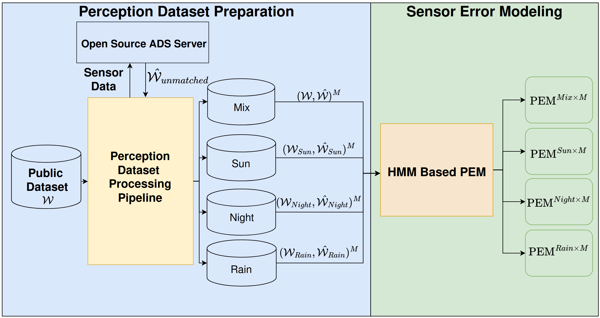

# Modeling Perception Errors Under Diverse Weather Conditions in Autonomous Vehicles
## Introduction
The full-time research internship. The main goal of the project is investiage the impact of various weather conditions to the perception error model (PEM).
## Project Description
### Problem statement
our objective is to investigate how weather conditions alter the error distributions that the PEM predicted. To tackle the problem, we train several weather-specific PEMs:
$\begin{equation}
     \hat{\mathcal{W}}_{C\times M} \approx \text{PEM}_{C\times M}(\mathcal{W}_{C\times M})\text{,}\nonumber
\end{equation}$
where $C$ is the set of weather conditions and $M$ is the set of sensor setups. In our work, $C = \{\text{sun}, \text{rain}, \text{night}\}$, and $M = \{\text{fusion of LiDAR and radar},\text{LiDAR only},\text{radar only}\}$.  
Then, investigating the statistical information of the error distributions that PEMs output. Specifically, we compare the means and standard deviation under different weather conditions i.e., $(\mu_{i},\sigma_{i})$, where $i \in C\times M$.

### Scope

### Phase 1: Perception Dataset Prepraration.
Contributions:
1. Converting nuScenes dataset (radar data especially) to the .record file (see [./scripts/nuscenes_converter](./scripts/nuscenes_converter/)) that can play on the Apolloauto system. Using the perception modules in the Apollo system to investigate perception outcome that perceived by Apollo, and compute the metrics (e.g., IOU) with the ground truth.
2. Automatically generate the customize sensor configuration in the Apollo (see [./scripts/Apollo_nuScenes_sensor_config/](./scripts/Apollo_nuScenes_sensor_config/)).
4. Implement the spatial-temperal matching algorithm for matching the ground truth objects and perceived objects (see [here](./scripts/match/)).
3. Combine above taskes, implement an automatically percetion dataset processing pipeline (see [here](./scripts/end_to_end_dataset_process_pipeline/)).

### Phase 2: Sensor Error Modeling
Contributions:  
Design and implement the HMM-based PEM. Train the PEM and investiage the errors generated by PEM.
1. Perception dataset preprocessing for PEM (see [here](./scripts/PEM_data_preprocessing/)).
2. HMM-based PEM training script (see [here](./scripts/PEM_trainig/)).
3. Weather conditions effect the error distribution gernerated by PEM.

### Schedule

### Progress 
Please refer to the following directory: [documents/weekly-report](https://github.com/HungFrancis/self-driving-internship-project/tree/main/documents/weekly-report).
