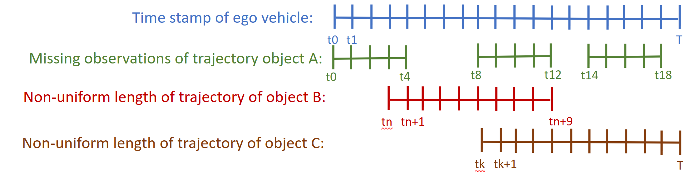
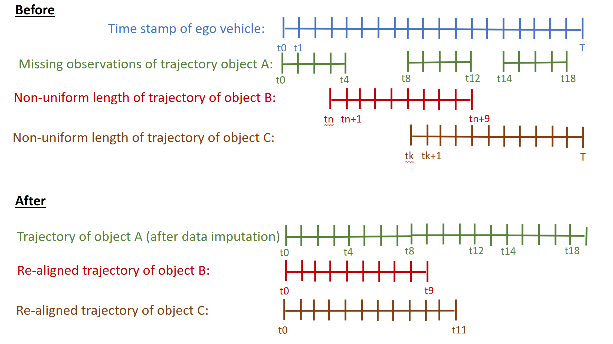

# Week 13 (From Oct.16 to Oct. 20)
**Summary of the week**  
1. Finish serialize the matching result to json files.
2. Since the nuscenes mini dataset only have 10 scenes (7 sun weather, 3 night, and no rain weather). Thus I download nuscenes trainval01 blobs to have more data on night and rain weather. 
3. Identify 2 problems in the dataset after matching:(1) Missing detection for specific object.(2) Non-uniformed length of different GT object.
4. Do the literature review on how to deal with these problem.
## Weekly outcome
1. Implement serialization and unserialization of the dataclass and object class. Since the matching process take severals minutes for one scene. Store the matching pairs to file would be a better method.

2. Missing detection in one sequence are defined as one or more missing value of detections in one trajectory of GT object. An examples is shown as green trajectory in below figure.
3. Non-uniformed length of different GT object is defined as one GT object have different number of time frame that appear in the FOV of sensors. Examples are shown as red and brown trajectory in below figure.

4. Why those two problem matter when training the HMM? (1)For the missing observations, since the HMM based PEM requires sequential data, and under every time frame, there should be an observation. However, if the output is missing, the dataset is incomplete for training. (2) For the non-uniform legnth of different object, since the HMM are trained by sequences of specific length of data. The training data with different length, and different start and end time frame may also be a problem.

5. Here are some method that often used to deal with missing data in the data science research: (1) Data imputation, imput the missing observation with the mean value or mode. (2) Gluing, delete the missing observation. But this method violate the nature of the sensing procedure. Since the missing detection is also another error we should also consider. The missing values in our case are non-ignorable. Since the missing detection is sort of "perception error", our PEM should model the miss detections as well. Here are some paper that discuss the missing observation in training HMM:
    | Name | Link |
    | :--|:--:|
    | Prognostic considering missing data: An input output hidden Markov model based solution | [link](https://www.researchgate.net/publication/363278372_Prognostic_considering_missing_data_An_input_output_hidden_Markov_model_based_solution)|
    |Intermittent Missing Observations in Discrete- Time Hidden Markov Models|[link](https://www.tandfonline.com/doi/full/10.1080/03610918.2011.581778)|
    |Training Hidden Markov Models on Incomplete Sequences|[link](https://www.researchgate.net/publication/305493313_Training_Hidden_Markov_Models_on_Incomplete_Sequences)|

6. For the non-uniformed length of sequence, the solution is more straigthforward, we can interpret the start of the HMM is the time frame that the ground truth object appears in the FOV of sensors. So we can just realign the frames for training. As for different length among different sequences, several papers ([here](https://www.physicsforums.com/threads/hmm-training-with-variable-length-data.613328/)) mention that there is no explicit demand to have fix-length sequences for training the HMM.

7. Here is the before/after comparison after pre-processing as shown in below figure.

## Next week task
### Normal
- Start to train HMM.
- Start writing the internship report. 
