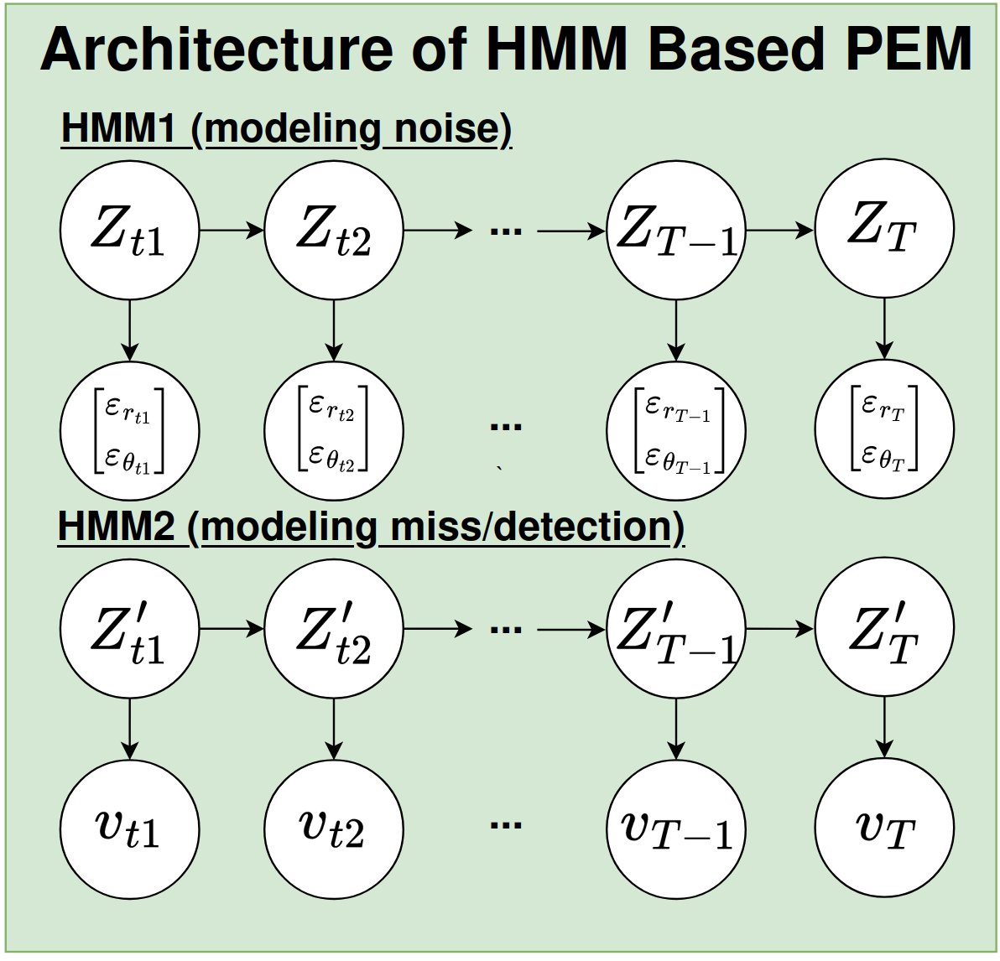

# Week 14 (From Oct.23 to Oct. 27)
## Weekly outcome
1. Formulate the model architecture of the PEMs, which using 2 HMMs, one is to modeling noise of sensor perception, the other one is to modeling state of miss/detection of sensor. The mindset before this model architecutre is because the perception error can be interpreted as noise of sensor and miss/detect of sensor.

2. Download subset of nuScenes dataset (trainval 01, 05, 10), and collect the groundtruth and detection pair in different weather condition (sun, night, rain).
## Next week task
### Normal
- Start to write the internship report and presentation slides.
- Build the training pipeline the the designed PEM.