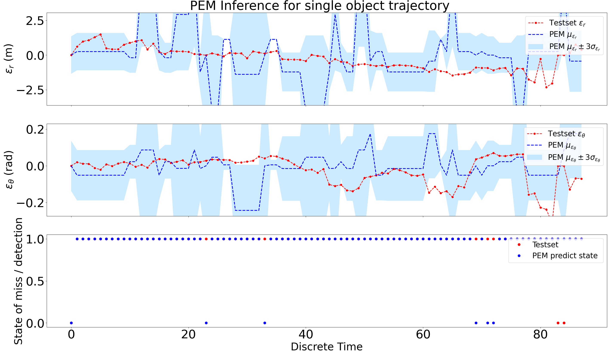
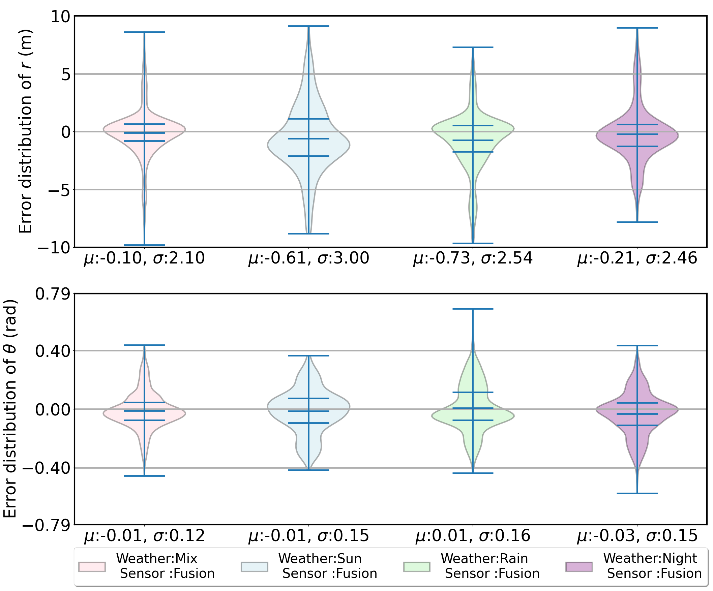

# Week 16 (From Nov. 6 to Nov. 10)
## Weekly outcome
1. Working on the workshop presentation and the report.
2. Visualizing the training result with two method: (1) Sequentially generate the noise by equation:
$\begin{equation}
\hat{O}(t) = \text{PEM}(O(t)) = \begin{bmatrix}v(t)\cdot(\varepsilon_r(t) + r(t))\\ v(t)\cdot(\varepsilon_\theta(t) + \theta(t)) \end{bmatrix}
\nonumber\end{equation}$

(2) We can also visualize it in distributions of samples generated by PEM, which is basically the predicted error.

## Next week task
### Normal
- Complete the 'experiment' part of the report.
- Analyze the experimental result. 