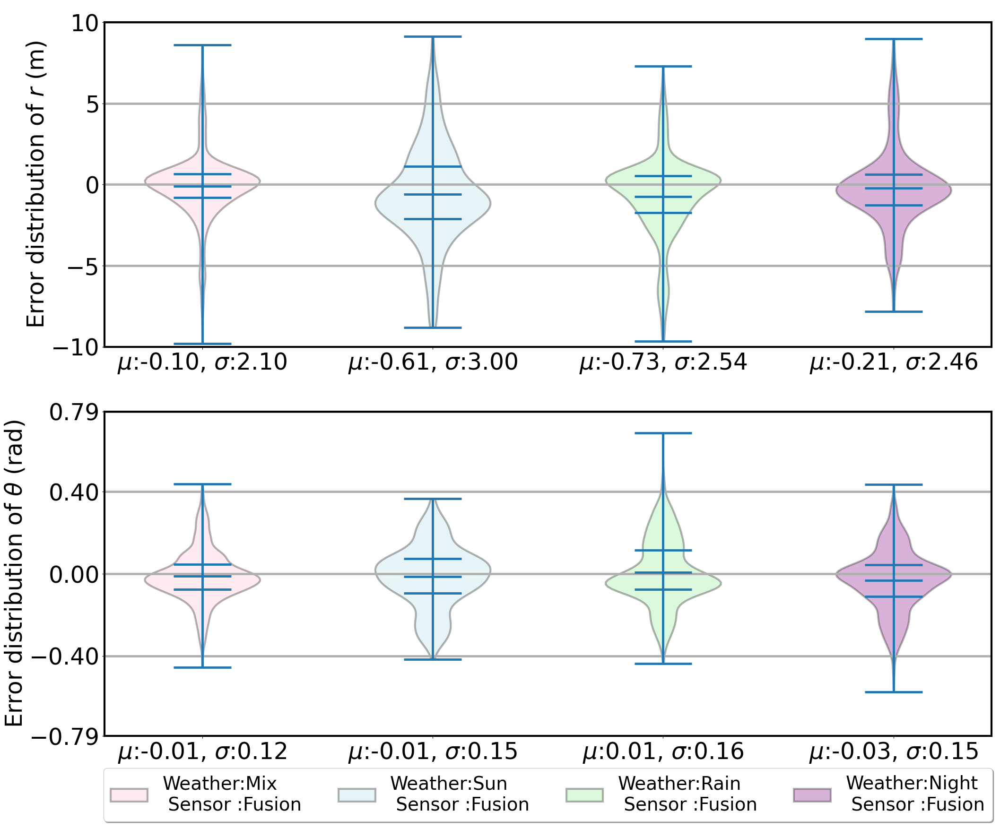
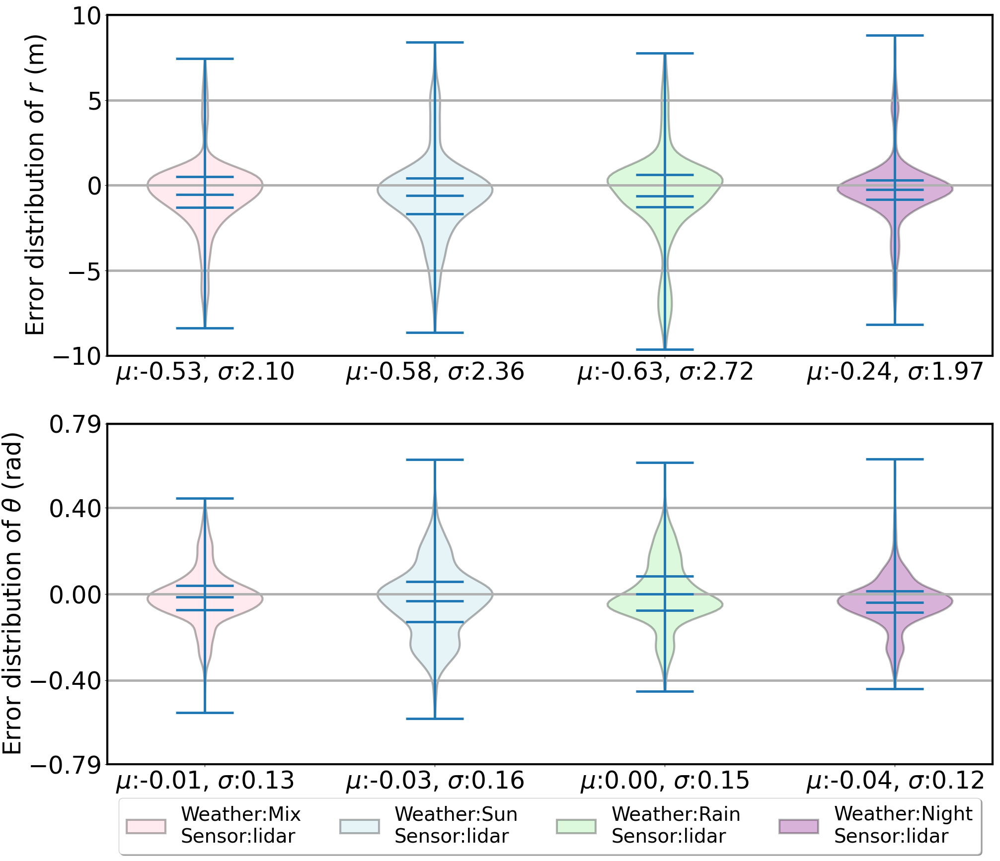
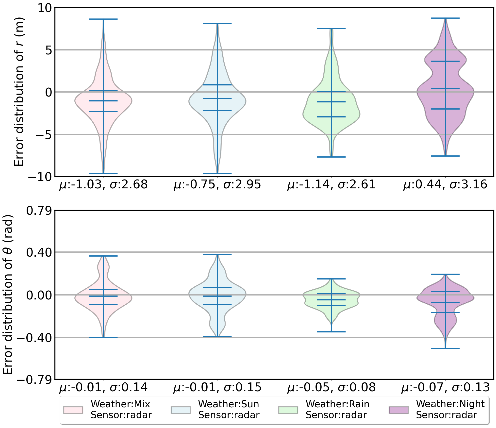

# Week 17 (From Nov. 13 to Nov. 17)
## Weekly outcome
1. Working on the workshop presentation and the report.
2. Train the PEM with diffferent weather conditions:
For fusion sensor setup:

For lidar sensor setup:

Fpr radar sensor setup:

#### Observations:
1. Should only compare the result for same sensor setup with different weather conditions, since the number of object trajectories used to train the PEM is different. (Radar has less object trajectories since the nuScenes dataset have sparse radar point cloud.)

2. For same sensor setup, the rainy weather has the largest mean error of $r$, the angular errors do not have too much different.

3. Compare weather-specific PEM with mix-weather PEM, the error distribution are quite different.
4. In the sun and night weather, shape of distributions are similar. The rainy weather is more different visally. 
#### Limitation:
1. Need more data (now it's only 60 scenes, but show extract more from nuScenes)

## Next week task
### Normal
- Complete the 'Conculsion', 'Introduction' part of the report.
- The experiemntal result have no much things to analyze. Try to contact consult NTU PhD.