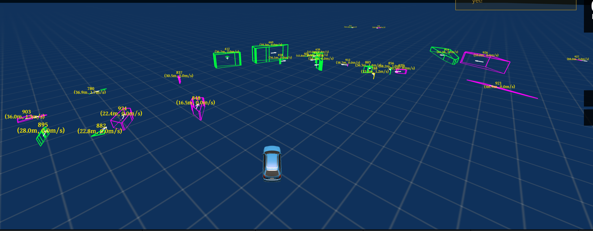
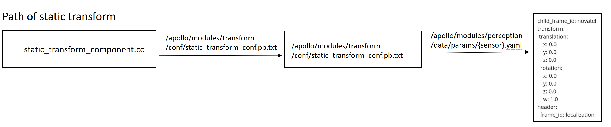

# Week 5 (Aug. 14 ~ Aug. 18) 
## Weekly outcome
- Successfully visualize the bounding box in the Dreamview, but need to calibrate the coordinate system.

- Study how to transform the sensor coordinate to the world and car coordinate system. (setup the .launch, .dag, .pb.txt file)

- Since the spec. of sensor are different to the default setting, are going to find how to modify the custom sensor setting in the apollo.
## Challenging task of the week:
- **Config file**  
Setup configuration file that transforming the sensor coordinate to the world and car coordinate system. (setup the .launch, .dag, .pb.txt file). Here is four steps to add a new component:
    1. Define the component with a header file (.h file)
    2. Implement defination of the component in c++ (.cc file)
    3. Create a `BUILD` file
    4. Create a `.dag` file. The Dag file is the config file of module topology. The components can be defined and specfic the upstream/downstream channels in the dag file.
    5. Create a `.lauch` file. The Launch file provides a easy way to start modules. By defining one or multiple dag files in the launch file, one can start multiple modules at the same time.
- **Coordinate transformation**  
Setup the coordinate transformation tree for the new sensor setting. The data path, data structure is set as shown in the following figure.

To activate the static transformation module, use the following command during the run time:
```
$ cyber_launch start /apollo/modules/transform/launch/static_transform.launch
```
## Next week task
### Normal
- Implement the configuration and coordinate transformation setting. 