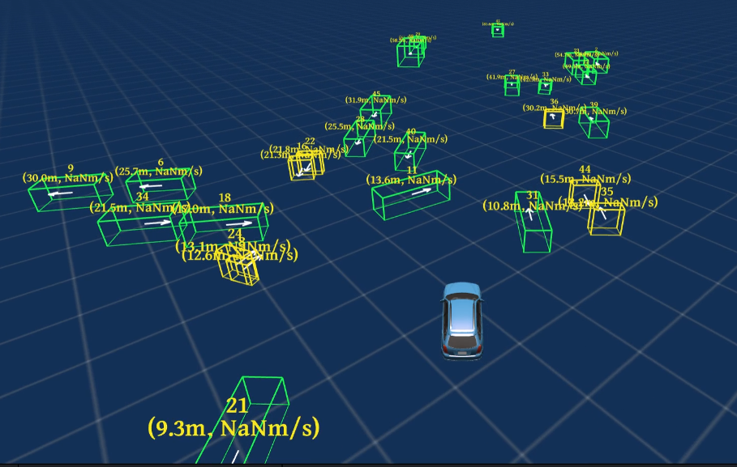
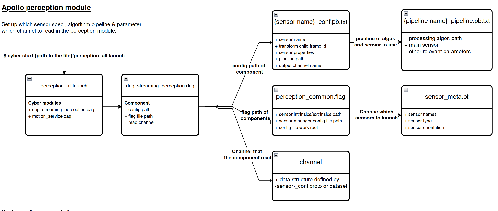
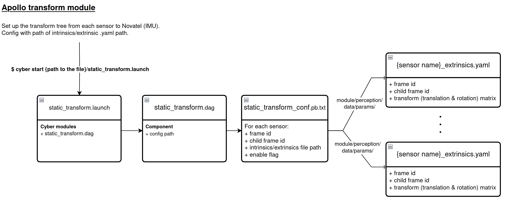

# Week 5 (Aug. 21 ~ Aug. 25)
**Summary of the week**  
1. Implement the nuScenes dataset configuration on the Apollo. Please refer to [scripts/Apollo_nuScenes_sensor_config/README.md](../../scripts/Apollo_nuScenes_sensor_config/README.md).
2. Update the [dataset converter](../../scripts/nuscenes_converter/dataset_converter.py) for PEMs training dataset. (record ground truth and detected objects.) 
3. Still debug for the issue that the output of perception module is incorrect orientation.
## Challenging task of the week:
### Steps to build customize sensor configuration on Apollo 
- This pipelie manage the setup of sensors and data processing pipelien setup of Apollo perception module. As shown in below, there is the relation among files that related to perception module. 

- The static transform manage the transformation between sensors. The static transform tree transforms one sensor frame to another sensor frame by transformation matrix. As shown in below, there is the relattion among files that related to transform module.

### Steps to record the ground truth of dataset to the .record file. 
- In order to make the training dataset for training the PEMs. We should make two record, one for ground truth in the `/apollo/perception/obstacles` channel and one for perceived object (sensing by perception module) in the same channel separately. The command is shown in below. The `-m` argument indicate the mode (depends on which you are recording, ground truth or perceived by perception module) that you record. 
```
python3 main.py -i {nuscenes_dataset_path} -o {output path} -m {gt or detection flag, default = detection} 
```
## Next week task
### Urgent
- Debug on the issue that the output of perception module is incorrect orientation.
- My laptop is freeze for 5 minutes after launching the perception module, will ask Dr. Justin for the computation resource (more RAM on GPU).
### Normal
- List tasks that you have scheduled to deal with.