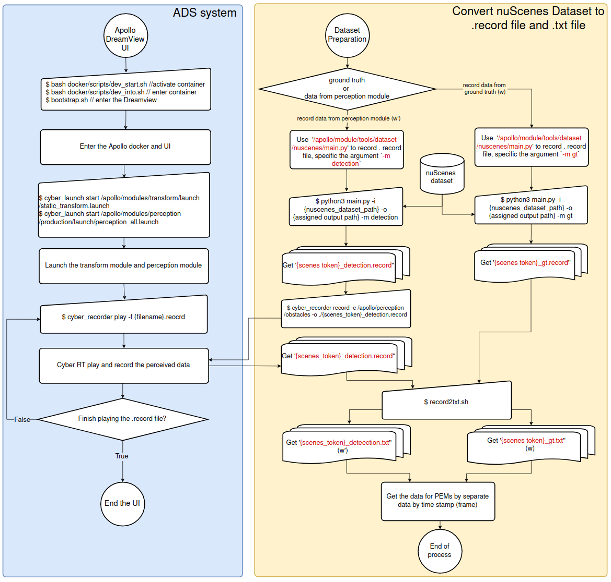

# Week 7 (Sept. 4 to Sept. 8)
**Summary of the week**  
1. Finish the dataset preparation pipline.
## Weekly outcome
- Finish the dataset preparation pipline that convert the nuScenes dataset to record files and txt files. Refer to the following instruction and flow chart.  
1. Use the `/apollo/module/tools/dataset/nuscenes/main.py` to record the gt and detection `.record` file.    
```
python3 main.py -i {nuscenes_dataset_path} -o {assigned output path} -m {gt or detection}
```
2. For ground truth dataset, use the `record2txt_gt.sh` to get text gt (w) dataset.
3. For detection data, activate the Apollo DreamView, perception module, use the `cyber_recorder record -c` to get the `*.record.0000` file first.  
 ```
cyber_recorder record -c {channel to record} -o {output filename}
 ```
4. Then put the resulted `*_detection.record.00000` under the directory of of `record2txt.sh`, use the shell script to get text detection (w’) and ground truth (w) dataset. The shell scripts is at [/scripts/PEM_dataset/record2txt.sh](../../scripts/PEM_dataset/record2txt.sh).
 ```
 ./record2txt.sh
 ```

## Next week task
### Normal
- A script that separate the dataset by weather condition.
- Make statistics on the dataset base on the weather condition.