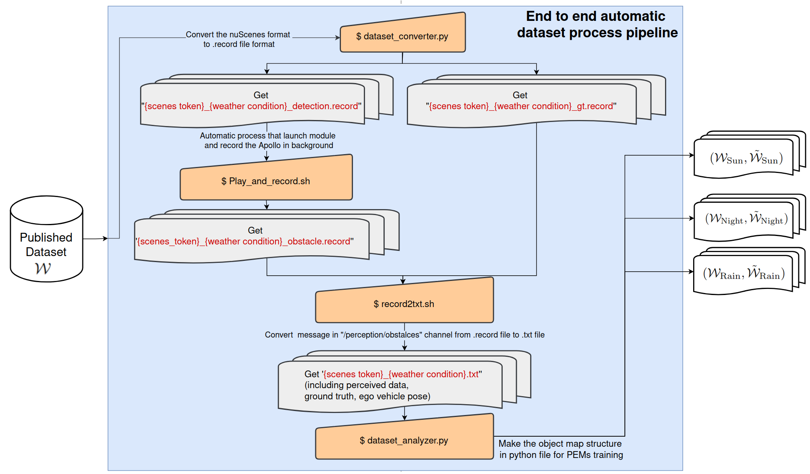
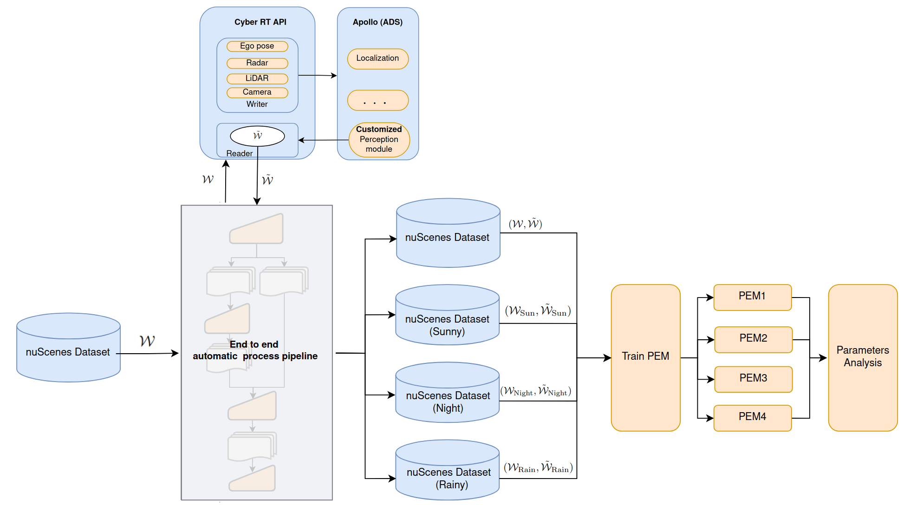

# Week 8 (From Sept. 11 to Sept. 15)
**Summary of the week**  
1. Make the shell script to automatically run the dataset preparation pipline and workplace. Now only need to enter 4 commands (can be less) to convert all the txt file dataset. 
2. Debug on the issue that the perceived dataset not totally record 19-second scenes. (For example, only record 10 second data.)
## Weekly outcome
1. Implement a shell script to automatically run the dataset preparation pipline and workplace. Now only need to enter following 4 commands to end-to-end convert all dataset the txt file dataset. In the future, this process pipline can **further compatible with any other publish dataset.** The detail of the implementation of the shell script, please refer to the [readme.md](../../scripts/end_to_end_dataset_process_pipeline/readme.md).
```
python3 main.py -i {nuscenes_dataset_path} -o {assigned output path} -m {gt or detection}
```
For detection record file, run the play_and_record to automatically launch the Apollo module and record the perceived objects in background.
```
{path to script}/play_and_record.sh
```

```
{path to script}/record2txt.sh
```
Then read the text file and build the object map and ground truth list data structure frame by frame in the python script for the furhter PEMs training.
```
python dataset_analyzer.sh
```
The reason that I use 3 commands instead of 1 command is to provide a check point to see whether files are converted correctly. The following figure is the flow chart of the pipelie.

The process pipeline is integrated in the internship workflow as shown in the following flow chart:

## Next week task

### Normal
- Convert and count the nuScenes V1.0-mini dataset to object list for PEMs training.
- Download more data from the nuScenes.
- Should count number of the data sample scene by scene.