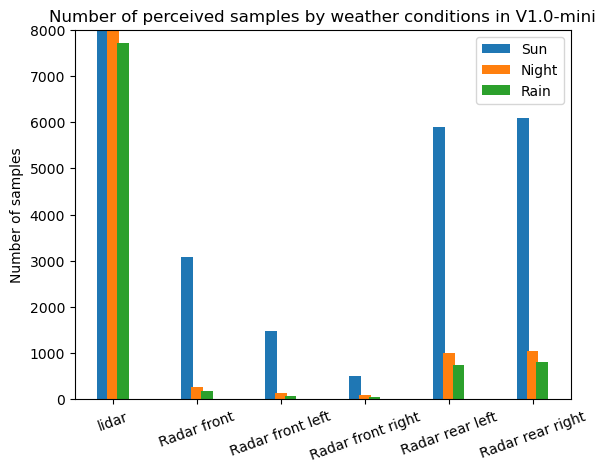

# Week 9 (From Sept. 18 to Sept. 22)
**Summary of the week**  
1. Sept. 21th Progress meeting preparation.
2. Implement dataset analyzer that count the number of samples perceived by different sensor for each scenes, and then sort out the raw data to (w(t),w'(t)) format, for the PEMs model training. 
3. Setup the automaitcally open work space setup config by gnome terminal. Refer to [here](../../scripts/end_to_end_dataset_process_pipeline/auto-terminal-setup/workplace.txt)
4. Andrea finally send the PEM training script to me two weeks later, will work on that. 
## Weekly outcome
## Challenging task of the week:
1. Finish the `data_analyzer.py` script. Build up the object 
```
class dataset_list(object):
    def __init__(self,scene_token):
        self.scene_token = scene_token
        self.sensor_data_list = []
        self.groudtruth_list = []
        # Object_map dim: [[detection_list_at_t1,gt_list_at_t1],\
        #                  [detection_list_at_t2,gt_list_at_t2].....\
        #                  [detection_list_at_tn, gt_list_at_tn]]
        self.object_map = []
        self.count_lidar32 = 0
        self.count_radar_front = 0
        self.count_radar_front_left = 0
        self.count_radar_front_right = 0
        self.count_radar_rear_left = 0
        self.count_radar_rear_right = 0
        # Number of gt samples
        self.nbr_gt_samples =0

@dataclass
class sensor_data:
    sensor_id : str
    id        : str
    position_x: float 
    position_y: float 
    position_z: float
    theta     : float
    width     : float
    length    : float 
    height    : float
    velocity_x: float
    velocity_y: float
    velocity_z: float
    type      : str
    time_stamp: float
    box_xmin  : float 
    box_ymin  : float
    box_xmax  : float
    box_ymax  : float

@dataclass
class ego_pose_data:
# Msg. in 'apollo/localization/pose' channel
    ego_position_x: float
    ego_position_y: float
    ego_position_z: float
    orientation_qx: float
    orientation_qy: float
    orientation_qz: float
    orientation_qw: float


@dataclass
class gt_data:
    id: str
    position_x : float
    position_y : float
    position_z : float
    theta      : float
    length     : float
    width      : float
    height     : float
    tracking_time: float
    type       : str
    time_stamp : float
    # Find same time stamp and declar the ego pose info.
    # base on the data struct of pose, are going to find the info. by:
    # pose {
    #     // Content we want 
    # }
    # measurement_time: xxxxx 
    ego_position_x: float
    ego_position_y: float
    ego_position_z: float
    orientation_qx: float
    orientation_qy: float
    orientation_qz: float
    orientation_qw: float
```
2. Count the number of data sample in the nuScenes V1.0-mini. 
   **Observation**:  
   1. The data of night and rain weather are rarely presented in the nuScenes V1.0-mini.  
   2. Radar dataset has less samples compare to the lidar data.  
   3. More data should be downloaded to tackle with the data imbalance issue.  

## Next week task
### Normal
- Download more data from the nuScenes.